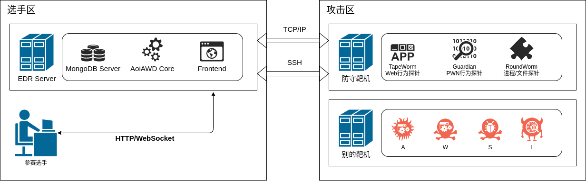

# AoiAWD-轻量级EDR系统
专为AWD比赛设计，便携性好，低权限运行的EDR系统。

## 应用场景
在常见的AWD比赛中，选手往往拥有一台（或若干台）开放了SSH服务和题目服务的“靶机”作为自己防守的阵地。

在实际比赛中，主办方往往会限制选手的SSH权限到一般用户/仅可管理题目的权限。并且针对一些常见的通用防火墙脚本（通防脚本）进行轮询式check。

AoiAWD是针对以上场景的限制和痛点设计的，组件间基于socket通信以便灵活部署，具有图形可视化界面。所有行为探针均支持在最低系统权限下运行，且默认不会干扰题目业务逻辑的正常运行，可以绕过绝大部分check脚本的行为检查。支持如下维度的行为捕获能力：
- Web输入输出数据捕获、输出流量篡改（没错，你可以动态替换掉输出的flag为任意字符串）
- PWN类题目输入输出交互流量包捕获、当次运行时内存结构捕获、输出流量篡改
- 服务器进程UID、PID、父进程、启动参数、运行时间捕获
- 服务器文件系统新建、删除、修改、权限变化行为捕获。

本系统还内置了生命周期钩子，可以针对某一次行为的产生编写特定的插件去实现流量层面的临时热补丁、增加大屏告警、替换输出字符等操作。系统默认内置了如下插件可供参考：
- FlagBuster: 当检测到输出流量中包含了符合正则的flag字符串，产生大屏告警、标记触发规则的数据包、并将flag精准替换为看起来也像flag的随机数。
- KingWatcher: KoH类比赛中，当有其他队伍替换掉了赛点文件时，产生大屏告警。
- ZombieKiller: 当文件系统上出现了不死马行为，标记可疑文件并产生大屏告警。

PS: AoiAWD是作者在大学期间作为一个专业的“外包型CTF选手”，应付各种线下AWD比赛所设计的系统，局限于当时的代码水平，请各位审计大佬轻喷（甚至希望大佬重构一下）。

PS2: 这比赛能打？

## 系统简介
AoiAWD 分为六个组件，组件间互相配合实现系统的完整功能
- MongoDB Server: 日志数据存储数据库
- AoiAWD Core: 中心数据处理与插件后端服务器
- Frontend: 数据可视化平台前端
- Guardian: PWN行为探针
- TapeWorm: Web行为探针
- RoundWorm: 系统进程与文件系统行为探针



## 编译、安装与使用方法
### MongoDB Server
用于记录庞大的流量文件的数据库，是整个系统的核心存储。
- 一般情况下建议和AoiAWD Core一起部署在选手自己可控的主机上。
- 无需额外的配置，Ubuntu环境下开箱即用，apt一下即可搞定。

### Frontend
Vue编写的Web前端，用来浏览日志，产生报警动画等可视化展示。
- 一般情况下编译后将与AoiAWD Core集成为一个可执行文件。
- 无需单独的运行启动。

### AoiAWD Core
是整个系统运行的核心，负责探针数据收集入库、插件生命周期管理、Web前端托管服务。
- 运行compile.php即可打包为一个单独的二进制文件，方便携带
- 一般情况下可直接无参数运行，如果需要特别的配置，可以增加-h参数查看帮助信息
```
AoiAWD: Data Visualization Tool & Main Server
Usage: ./aoiawd.phar [OPTIONS]
         -w [URI] HTTP server bind URI. Default: tcp://0.0.0.0:1337
         -l [URI] Log recoard server bind URI. Default: tcp://0.0.0.0:8023
         -m [URI] MongoDB server URI. Default: mongodb://127.0.0.1:27017
         -t [STRING] Access token. Default: [RANDOM]
         -h This help info
```
- 运行后会显示本次启动后的临时密钥，是访问Web前端的必要信息
```
[2020-09-24 15:21:21] MainServer.notice: AccessToken: 0de8d57b3e91dc66 [] [] #<-- Web访问密钥
...
[2020-09-24 15:21:21] Amp\Http\Server\Server.info: Listening on http://0.0.0.0:1337/ [] [] #<-- Web前端地址
[2020-09-24 15:21:21] aoicommon\socket\AsyncTCPServer.info: Listening on 0.0.0.0:8023 [] [] #<-- 探针上线地址
```
### Guardian

### TapeWorm

### RoundWorm

## 系统截图
